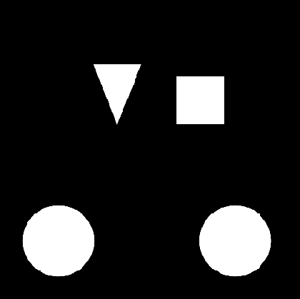

# BwLabel function for Python

This script processes binary images to identify and analyze objects within them. It computes various properties such as area, bounding box, centroid, orientation, eccentricity, perimeter, aspect ratio, solidity, and extent. Additionally, it provides 
interactive visualization and property saving options.

## Features

- Detects and labels objects in a binary image;
- Computes various properties for each object;
- Has an interactive mode to inspect objects one by one;
- Allows saving the object properties to a file;
- Computes properties average values for all saved objects;
- Filters and selects objects based on specified property thresholds.

## Requirements

Required dependencies:

```sh
pip install numpy scipy opencv-python skimage screeninfo
```

## Usage

Example image : 



**binary_image.png**

### ***show_labels_and_props(bin_img)*** 

Detect and analyze objects

**Parameters** : bin_img - binary image.

**Returns** : None.
  
```py
import cv2
import bwlabel as bw
# Load a binary image
bin_img = cv2.imread("binary_image.png", cv2.IMREAD_GRAYSCALE)
bw.show_labels_and_props(bin_img)
```


- Press 'N' to go to the next object.
- Press 'B' to go back to the previous object.
- Press 'S' to save properties to 'properties.txt'.
- Press 'Q' to exit.

### ***average_properties()*** 

Computes Average Properties

**Parameters** : txt_file - (default 'properties.txt').

**Returns** : None.

```py
bw.average_properties()
```
Takes the txt file produced in the previous function 'properties.txt' and prints in the terminal the average values for all properties.

### ***[filtered_image, selected_bboxes] = select_objects(img, properties, thresh_area= 1200, thresh_sol_ext_ecc= 0.045)*** 

Select Objects Based on Properties

**Parameters** :

- img - binary image to process;
- properties - list of length 4 - [area, solidity, extent, eccentricity];
- thresh_sol_ext_ecc - threshold for the solidity, extent and eccentricity values (default 0.045);
- thresh_area - threshold for the area value (default 1200).

**Returns** :

- filtered_image - final image with the selected objects;
- selected_bboxes - list of the bounding boxes [min_row, min_col, max_row, max_col] of all objects found.
